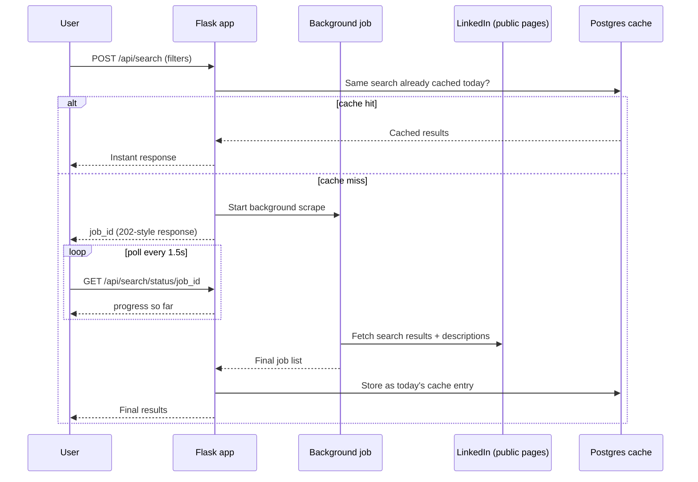

<div align="center">

# JOBBS

**Find every job, the moment it's posted.**

A full-stack job search platform — live LinkedIn postings, filtered by category, country, posting date, and workplace type, with secure auth and a same-day results cache. Built free, top to bottom, no paid APIs.

[](https://www.python.org/)
[](https://flask.palletsprojects.com/)
[](https://www.sqlalchemy.org/)
[](./LICENSE)
[](#deployment)

</div>

---

## Contents

- [What it does](#what-it-does)
- [Tech stack](#tech-stack)
- [How search + caching works](#how-search--caching-works)
- [Project layout](#project-layout)
- [Getting started locally](#getting-started-locally)
- [Environment variables](#environment-variables)
- [Deployment (100% free tier)](#deployment-100-free-tier)
- [Security](#security)
- [SEO](#seo)
- [Known limitations](#known-limitations)
- [Roadmap ideas](#roadmap-ideas)
- [License](#license)

---

## What it does

JOBBS lets a signed-in user search live job postings with real filters — not vanity toggles:

| Filter | Options |
|---|---|
| **Category / keyword** | Free text, with common categories suggested |
| **Country** | 50+ countries, or Worldwide |
| **Posted within** | Any time / past 24 hours / past week / past month |
| **Workplace type** | Any / On-site / Remote / Hybrid |
| **Result count** | Up to 50 per search |

Press **Find jobs** and the app scrapes fresh results in the background, streaming progress back to the page with a live counter — no reload. Once a search has run today, anyone repeating the exact same filters gets the cached result back instantly instead of re-scraping.

**Auth:** email + password (hashed, verified by email before first login) or Google Sign-In — one account per email address, whichever method claims it first.

## Tech stack

- **Backend:** Python, Flask, SQLAlchemy, Flask-Login, Flask-WTF (CSRF), Flask-Limiter (rate limiting), Flask-Talisman (security headers/HSTS), Authlib (Google OAuth)
- **Scraping:** httpx (async) + BeautifulSoup, wrapped in a background-thread job runner with live progress polling
- **Database:** SQLite locally, Postgres in production (SQLAlchemy handles both — same code, different `DATABASE_URL`)
- **Email:** Brevo's transactional HTTP API (works on hosts that block outbound SMTP), with SMTP and console-log fallbacks
- **Frontend:** Server-rendered Jinja2 templates, hand-written CSS (no framework), vanilla JS for the search flow
- **Hosting:** Render (web service) + Neon (Postgres) + Brevo (email) — all free, no card required anywhere

## How search + caching works



## Project layout

```
jobbs/
├── app/
│   ├── auth/            registration, login, Google OAuth, email verification
│   ├── main/            landing page, dashboard, search API, background job manager, SEO routes
│   ├── scraper/         scraping engine + country/category/filter lists
│   ├── templates/       Jinja2 pages
│   ├── static/          css / js / logo
│   ├── models.py        User, SearchCache
│   ├── config.py        reads everything from environment variables
│   └── extensions.py    Flask extension instances
├── data/                users_export.csv lands here (non-secret signup fields only)
├── instance/            jobbs.db (SQLite) lands here, local dev only
├── wsgi.py              production entrypoint — gunicorn wsgi:app
├── run_dev.py           local dev entrypoint — python run_dev.py
├── requirements.txt
├── Procfile             start command for Render/Heroku-style hosts
├── .env.example         copy to .env and fill in
└── LICENSE
```

## Getting started locally

```bash
python -m venv venv
venv\Scripts\activate          # Windows
# source venv/bin/activate     # macOS/Linux

pip install -r requirements.txt
copy .env.example .env         # Windows: copy · macOS/Linux: cp
python run_dev.py
```

Visit `http://127.0.0.1:5000`. With no email provider configured, verification links print to the terminal instead of being emailed, so the full signup flow is testable with zero external setup.

## Environment variables

All read from `.env` locally, or from your host's dashboard in production. Full annotated list lives in [`.env.example`](./.env.example) — summary:

| Variable | Required? | Purpose |
|---|---|---|
| `SECRET_KEY` | Yes | Session signing, CSRF, tokens |
| `SITE_URL` | Yes (prod) | Builds absolute URLs (sitemap, OAuth callback) |
| `DATABASE_URL` | No | Defaults to local SQLite; set to a Postgres URL in production |
| `GOOGLE_CLIENT_ID` / `GOOGLE_CLIENT_SECRET` | For Google Sign-In | From Google Cloud Console → Credentials |
| `BREVO_API_KEY` / `BREVO_SENDER_EMAIL` | For real verification emails | Free at app.brevo.com — works where SMTP is blocked |
| `MAIL_*` | Optional fallback | SMTP, only used if Brevo isn't configured |
| `GOOGLE_SITE_VERIFICATION` | For Search Console | The `content` value from the HTML-tag verification method |
| `GOOGLE_ANALYTICS_ID` | Optional | GA4 measurement ID |

## Deployment (100% free tier)

The stack this project is built and tested against:

1. **GitHub** — hosts the source
2. **Render** (free web service) — runs the app; no card required
3. **Neon** (free Postgres) — persists data forever, unlike Render's free database which expires after 30 days
4. **Brevo** (free transactional email API) — sends verification emails over HTTPS, since Render's free tier blocks outbound SMTP ports entirely

High-level flow: push to GitHub → connect the repo in Render → set environment variables in Render's dashboard → set `DATABASE_URL` to your Neon connection string → set `BREVO_API_KEY`/`BREVO_SENDER_EMAIL` → deploy. First boot auto-creates all database tables.

Because free Render services sleep after 15 minutes idle, a scheduled GitHub Actions workflow (`.github/workflows/keep-alive.yml`, add it yourself if you want this) can ping the site every 10 minutes to keep it warm — optional, and worth pairing with a free external monitor like UptimeRobot for redundancy.

## Security

- Passwords hashed (never stored or exported in plain text)
- CSRF protection on all state-changing requests
- Rate limiting on auth and search endpoints
- Secure, `HttpOnly`, `SameSite` session cookies + HSTS + CSP via Flask-Talisman
- Parameterized queries throughout (SQLAlchemy ORM, no raw SQL string-building)
- `pool_pre_ping` on the database engine so stale serverless-Postgres connections reconnect transparently instead of surfacing 500s
- One account per email address, enforced at the database level

## SEO

Per-page meta tags and Open Graph tags, `/robots.txt`, `/sitemap.xml`, a slot for the Google Search Console HTML-tag verification value, and an optional GA4 snippet — all wired through environment variables, no hardcoding required.

## Known limitations

- **Scraping is against LinkedIn's User Agreement.** This reads LinkedIn's public, unauthenticated job-search pages — no login, no private data — but LinkedIn actively rate-limits and can change its markup at any time, which will eventually require updating the CSS selectors in `app/scraper/linkedin_scraper.py`. Treat this as a personal/portfolio project rather than a public product scraping LinkedIn at scale.
- **In-memory job tracking.** Search progress lives in the running process's memory, so the app is designed for a single worker/instance. Scaling beyond that means swapping `app/main/job_manager.py` for a real task queue (Celery + Redis, or RQ).
- **Free-tier cold starts.** Render's free web services sleep after 15 minutes idle and take 30–60 seconds to wake on the next request.

## Roadmap ideas

- Saved searches + email alerts for new postings matching a saved filter set
- Pagination / infinite scroll past the first result page
- Per-user search history view
- Swap the in-memory job queue for Celery + Redis to support multiple workers

## License

Released under the MIT License — see [`LICENSE`](./LICENSE).

```
MIT License

Copyright (c) 2026 Cheran Sanketh

Permission is hereby granted, free of charge, to any person obtaining a copy
of this software and associated documentation files (the "Software"), to deal
in the Software without restriction, including without limitation the rights
to use, copy, modify, merge, publish, distribute, sublicense, and/or sell
copies of the Software, and to permit persons to whom the Software is
furnished to do so, subject to the following conditions:

The above copyright notice and this permission notice shall be included in all
copies or substantial portions of the Software.

THE SOFTWARE IS PROVIDED "AS IS", WITHOUT WARRANTY OF ANY KIND, EXPRESS OR
IMPLIED, INCLUDING BUT NOT LIMITED TO THE WARRANTIES OF MERCHANTABILITY,
FITNESS FOR A PARTICULAR PURPOSE AND NONINFRINGEMENT. IN NO EVENT SHALL THE
AUTHORS OR COPYRIGHT HOLDERS BE LIABLE FOR ANY CLAIM, DAMAGES OR OTHER
LIABILITY, WHETHER IN AN ACTION OF CONTRACT, TORT OR OTHERWISE, ARISING FROM,
OUT OF OR IN CONNECTION WITH THE SOFTWARE OR THE USE OR OTHER DEALINGS IN THE
SOFTWARE.
```

---

<div align="center">
<sub>Built by Cheran Sanketh · job data sourced from public listings for informational purposes</sub>
</div>
